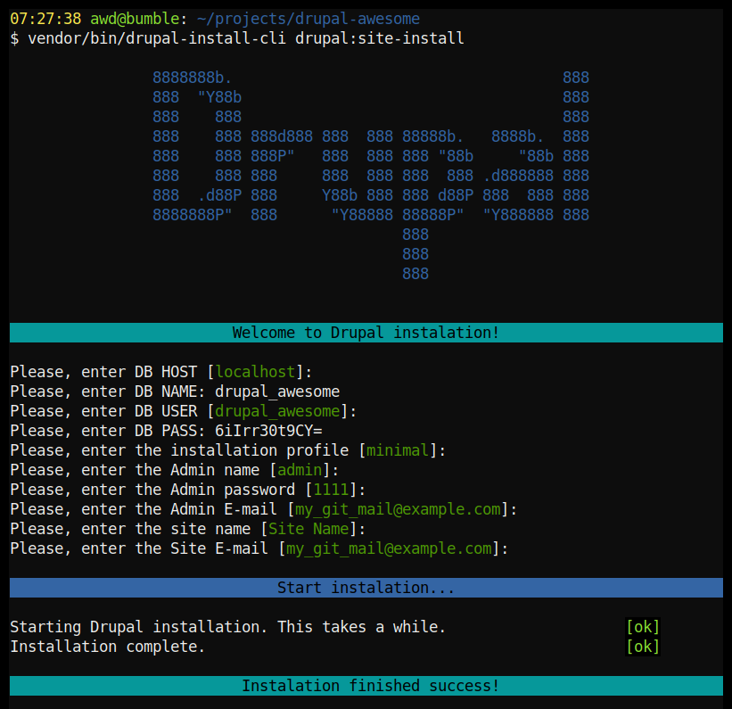

# Drupal Install CLI

Provide a command for installing drupal with drush from the command line 

This package should be used with one of [Drupal Composer project](https://www.drupal.org/docs/develop/using-composer/using-composer-to-manage-drupal-site-dependencies).



For now, plugin can install sites only with [Drush](http://www.drush.org), so it must be required in your project.

-----

## Requirements
- PHP ^7.1
- [Composer](https://getcomposer.org) package manager
- [Drush](http://www.drush.org) a command line shell for DRUPAL
- [symfony/console](https://github.com/symfony/console) ^2.1 || ^3.0 || ^4.0

## Install
Via [Composer](https://getcomposer.org/)
```bash
composer require awd-studio/drupal-install-cli
```

Or add a dependency on **awd-studio/drupal-install-cli** to your project’s composer.json file:
```json
{
    "require": {
        "awd-studio/drupal-install-cli": "dev"
    }
}
```

## Usage:

Just call command from CLI:
```bash
vendor/bin/drupal-install-cli
```
Answer all questions and it'll be done.

You also may pass the options for configure installation.
As example:
```bash
vendor/bin/drupal-install-cli drupal:site-install --db-host='localhost' --db-user='[MY_DB_USER]' --db-name='[MY_DB_NAME]' --db-pass='[MY_DB_PASS]'
```

## Available options:
- **--db-host** - Database host
- **--db-name** - Database name
- **--db-user** - Database user name
- **--db-pass** - Database user password
- **--profile** - Installation profile name
- **--site-name** - Your future site name
- **--site-mail** - Site E-mail
- **--admin-login** - Admin user name
- **--admin-pass** - Admin user password
- **--admin-mail** - Admin user E-mail
